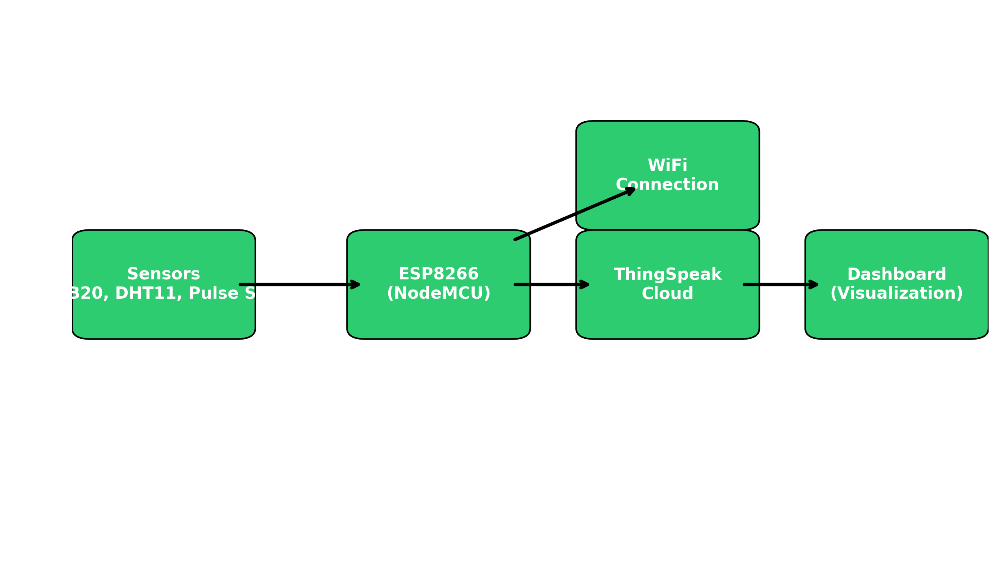
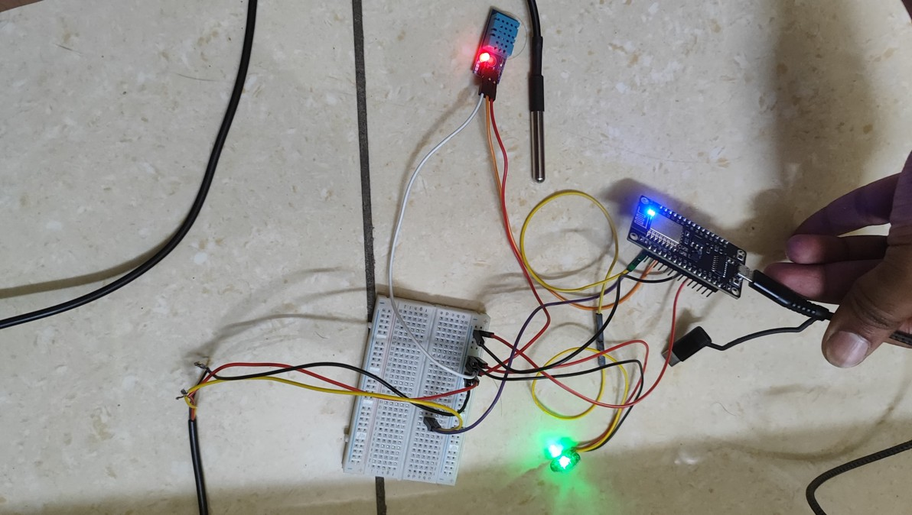
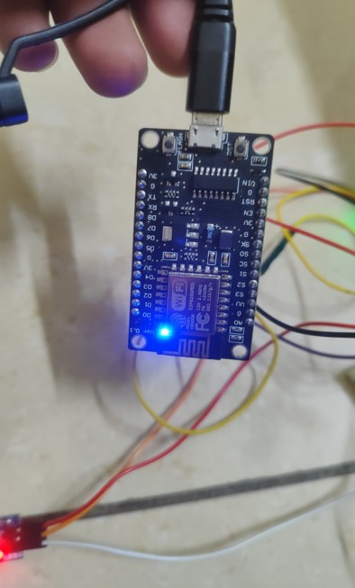
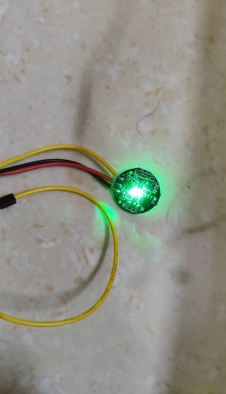
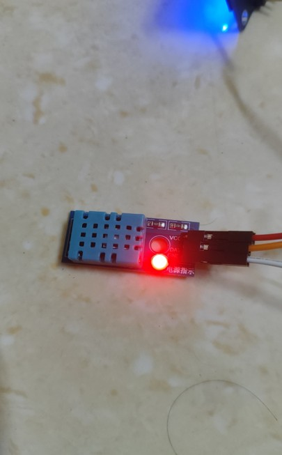

# IoT-Based Patient Monitoring System with Cloud Integration ☁️🩺

## 📌 Overview
This project is an **IoT-based Patient Supporting System** that continuously monitors:
- Body Temperature (DS18B20)
- Room Temperature & Humidity (DHT11)
- Heart Rate (Pulse Sensor)

It uses **ESP8266 (NodeMCU)** for data collection and uploads results to **ThingSpeak Cloud** for remote monitoring.

---

## 🚀 Features
- Real-time monitoring of patient vital signs
- Cloud integration with ThingSpeak
- Remote data visualization through web dashboard
- Automated data acquisition every 20 seconds
- Error handling for faulty sensor reads
- Scalable for multiple patients

---

## 🛠 Hardware Components
- **ESP8266 NodeMCU**
- **DS18B20** Temperature Sensor
- **DHT11** Humidity & Temperature Sensor
- **Pulse Sensor**
- Breadboard + Jumper Wires
- WiFi Connection

---









## 🔧 Setup Instructions
1. Clone this repository:
   ```bash
   git clone https://github.com/your-username/IoT-Patient-Monitoring-System.git
